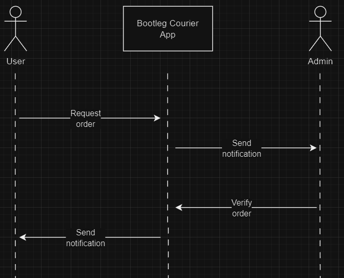
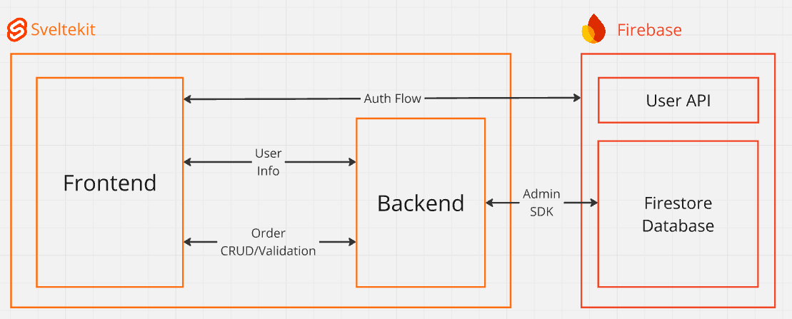

# Bootleg courier

Projekt indywidualny na projektowanie aplikacji internetowych.

# Założenia

Projekt zakładał stworzenie platformy dla nieistniejącego kuriera do trackowania zamówień i zarządzaniu jej stanem. Użytkownik powininen móc tworzyć nowe zamówienia i je wycofywać, a administrator systemu może akceptować albo odrzucać paczki, dając przewidywaną datę doręczenia przesyłki.

W dalszej części administrator również mógłby wysyłać informacje o statusie przesyłki (odebrane od nadawcy, przyjęte w oddziale firmy w danym mieście, wydana do deręczenia, itp.).

By użytkownik i admin wiedział o zmianie statusu zamówienia przez drugiego użytkownika, system powinien wysyłać powiadomienia.

### User flow dla tworzenia i weryfikacji zamówienia



# Architektura i technologie

Za backend i frontend odpowiada Sveltekit, który jest fullstackowych frameworkiem w Javascripcie/Typescripcie, gdzie frontend pisze się w Svelcie.

## Sveltekit

[dokumentacja](https://kit.svelte.dev/)

Sama biblioteka opiera się na trzech ważnych konceptach.

### Komponenty

Tak samo jak w Reactie, Svelte wykorzystuje komponenty czyli fragmenty UI, które możemy używać wielokrotnie. Taka jest różnica w Svelcie, że z założenia ma to przypominać prosty HTML i ma posiadać bardzo prostą reaktywność, nie wymagającą nauki mechanizmów biblioteki.

### Routing

[dokumentacja](https://kit.svelte.dev/docs/routing)

Sveltekit wykorzystuje system folderów i plików do budowania struktury i routowania strony. Każdy folder to jest osobna podstrona, gdzie sama podstrona może mieć parametry (jak na przykład api/orders/[id=uid], gdzie id jest tym parametrem).

W tych folderach można mieć dowolne pliki, ale pliki o tych nazwach mają specjalne znaczenie:

- +layout.svelte - definiuje layout UI dla tej podstrony i wszystkich głębszych podstron, idealne na np. navbar
- +page.svelte - sama treść routu
- +server.ts - operacje które mają być tylko po stronie serwerowej, można tu zdefiniować requesty HTTP jak GET, POST, PUT, DELETE oraz form actions to wykonywania operacji na wysłanych formularzach
- +error.svelte - strona z błędem
- +page.ts - opcje renderowania strony - czy to ma być renderowanie po stronie klienta, czy po stronie serwera z częściową hydracją. Dodatkowo może tam być zdefiniowany load, który się wykona przed załadowaniem strony, idealne jak trzeba przed jej pokazaniem zarequestować jakieś zasoby.
- +page.server.ts - to samo co wyżej, tylko że nie ma opcji renderowania i wykonywane jest to tylko po stronie serwera

### Separacja klient/server

Pomijając że kody źródłowe klienta i serwera są w tym samym projekcie i mogą być w tych samych folderach, to sveltekit dobrze sobie radzi z rozdzielaniem ich. Możemy np. explicite powiedzieć, że dane pliki z kodem mogą być tylko po stronie serwerowej i importowanie ich po stronie klienta skutkuje błędem.

## Firebase

Firebase jest wykorzystywany jako baza danych użytkowników oraz zamówień, ale dostęp do zasobów jest chroniony i udostępniany tylko przez firebase-admin.

Frontend ma tylko dostęp do weryfikacji użytkownika, uzyskując ciasteczka potrzebne do weryfikacji. Następnie przekazuje je do requestów do backendu, który wykonuje weryfikacje autentyczności ciastek i następnie sam komunikuje się z bazami danych.

Sam frontend nie ma informacji o połączeniu z Firebasem (czyli app Id, secret, itp.), tylko dowiaduje się o tym od backendu, który szyfruje te informacje. W dalszej części można zamienić szyfrowanie prostym kluczem szyfrowaniem asynchronicznym.

## Pozostałe moduły

- crypto-js - używany do szyfrowanie informacji o Firebasie
- uuid - używany do generowanie uuid
- sass- preprocessor do stylów CSS
- cookie - serializowanie ciastek przy ustawianiu ich
- prettier, eslin - formatowanie kodu

# Quickstart

Zanim będziesz w ogóle odpalał aplikacje, potrzebuje sekretów, które powinny się znaleźć w pliku `.env`.

```
DATABASE_URL = "<SEKRET>"
apiKey= "<SEKRET>"
authDomain= "<SEKRET>"
databaseURL= "<SEKRET>"
projectId= "<SEKRET>"
storageBucket= "<SEKRET>"
messagingSenderId= "<SEKRET>"
appId= "<SEKRET>"
measurementId= "<SEKRET>"
```

Owe sekrety należy pozyskać z konsoli Firebase'a.

Dodatkowo w panelu Admin SDK w Firebasie należy wygenerować certyfikat w formie JSONa oraz wstawić to do ścieżki `src/lib/server/cert.json`

Po sklonowanie repo należy zainstalować wszystkie potrzebne moduły.

```
npm install
```

Oraz odpalić tą komendę

```
npm run dev
```

Wtedy na porcie 5137 powinna pojawić się aplikacja.